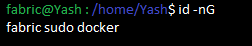
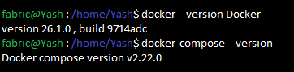

# ENV/Prerequisites
- cURL — latest version
- Docker — version 17.06.2-ce or greater [DOCKER INSTALLATION](https://github.com/KRIISHSHARMA/DOCKER)
- Docker Compose — version 1.14.0 or greater
- Golang — version 1.11.x [GOLANG INSTALLATION](https://github.com/KRIISHSHARMA/go-installation)
- Nodejs — version 8.x (other versions are not in support yet)
- NPM — version 5.x
- Python 


# Create a new sudo user

- add new user 'fabric'
``` sh
sudo adduser fabric
```
- Add the user “fabric” to the Sudo groups
``` sh
sudo usermod -aG sudo fabric
```
- Login to “fabric” user
``` sh
su  fabric
```

- add the user to docker group
``` sh
sudo usermod -aG docker fabric
```

- Logout using `exit` command and log in again. Check the groups' user is part of,using `id -nG` command.


- Check Docker and Docker Compose versions / if installed properly
  


# Installing Samples, Binaries and Docker Images

- download the latest production release.
  
``` sh
curl -sSL http://bit.ly/2ysbOFE | bash -s
```

- OR install a specific version
``` sh
curl -sSL http://bit.ly/2ysbOFE | bash -s -- 1.4.1 1.4.1 0.4.15
```

## Errors faced : 
- if you get permission denied error , become a super user `sudo su` then again try above cmd


# Testing the fabric Network

Open the fabric-samples and go to the test-network.
``` sh
cd fabric-samples/test-network
```
- In this directory, you can find an annotated script, network.sh, that stands up a Fabric network using the Docker images on your local machine
- From inside the test-network directory, run the following command to remove any containers or artifacts from any previous runs:
``` sh
./network.sh down
```
You can then bring up the network by issuing the following command. You will experience problems if you try to run the script from another directory:
``` sh
./network.sh up
```
- OR you can also bring up the network with Certificate Authorities.
``` sh
./network.sh up -ca
```


# Creating a Channel 
- Error in creating a channel (have to troubleshoot)
``` sh
Error: Post "https://localhost:7053/participation/v1/channels": dial tcp 127.0.0.1:7053: connect: connection refused

Channel 'mychannel' created
Joining org1 peer to the channel...
Using organization 1
+ peer channel join -b ./channel-artifacts/mychannel.block
+ res=1
+ peer channel join -b ./channel-artifacts/mychannel.block
+ res=1
+ peer channel join -b ./channel-artifacts/mychannel.block
+ res=1
+ peer channel join -b ./channel-artifacts/mychannel.block
+ res=1
Error: error getting endorser client for channel: endorser client failed to connect to localhost:7051: failed to create new connection: connection error: desc = "transport: error while dialing: dial tcp 127.0.0.1:7051: connect: connection refused"
After 5 attempts, peer0.org1 has failed to join channel 'mychannel' 
```
